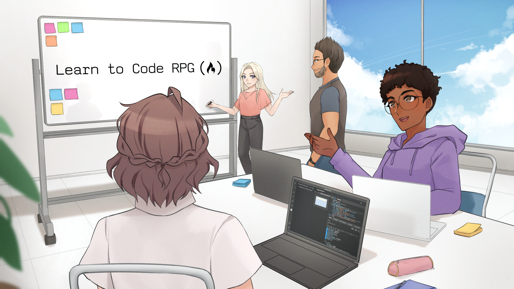

# freeCodeCamp Developer Quiz

The [developerquiz.org](https://developerquiz.org/) website is the companion to [Learn to Code RPG Game](https://freecodecamp.itch.io/learn-to-code-rpg), a visual novel game developed by [freeCodeCamp](https://www.freecodecamp.org) to help you learn how to code. 😺

[developerquiz.org](https://developerquiz.org/) hosts all **1000+** multiple choice questions featured in the game on the following topics:

- HTML 🖊️
- CSS 🎨
- JavaScript ⚙️
- Linux 🐧
- Python 🐍
- Git 📁
- SQL 📊
- IT 🖥️
- Quality Assurance ✅
- Agile ⏩
- Security 🔒
- and Computer Science Concepts 🤖

All questions are beginner friendly and approachable to all levels, so they are ideal for refreshing your programming knowledge.

If you are brand new to programming, learn to code for free and start your programming journey with [freeCodeCamp](https://www.freecodecamp.org/).

freeCodeCamp creates thousands of articles, videos and courses on a variety of coding topics.

All of the helpful and thoughtful resources are made possible by the generous donations of kind people.

Have a look [here](https://www.freecodecamp.org/news/how-to-donate-to-free-code-camp/) at the different ways you can support our non-profit's mission and make tech education accessible to all.

## How to run the project locally

Here are directions on how to fork the freeCodeCamp/Developer_Quiz_Site repository: 
https://docs.github.com/en/get-started/quickstart/fork-a-repo

In the command line:

1. Clone the repo by typing `git clone https://github.com/YOUR-GITHUB-USERNAME/Developer_Quiz_Site.git`
2. Then type `cd Developer_Quiz_Site` to go into the project's directory.
3. Install dependencies with `npm install`
4. Run the project with `npm start`
5. Have fun 🚀

### How to contribute

This open source project is a work in progress and ever evolving.

We welcome all contributions, suggestions and ideas for improvement from the community.

You can contribute by fixing bugs in the codebase, proposing new features or adding new questions.

Make sure to first read through the [Code of Conduct](https://www.freecodecamp.org/news/code-of-conduct/).

Then, read through our [Contributing Documentation](CONTRIBUTING.md).

### How to report bugs

Found a bug while playing?

Read through [this helpful article](https://forum.freecodecamp.org/t/how-to-report-a-bug-to-the-freecodecamp-open-source-community/19543) on how to report bugs.

Then, report them by opening a **GitHub Issue**.

### License

Copyright © 2021 freeCodeCamp.org, All rights reserved.
